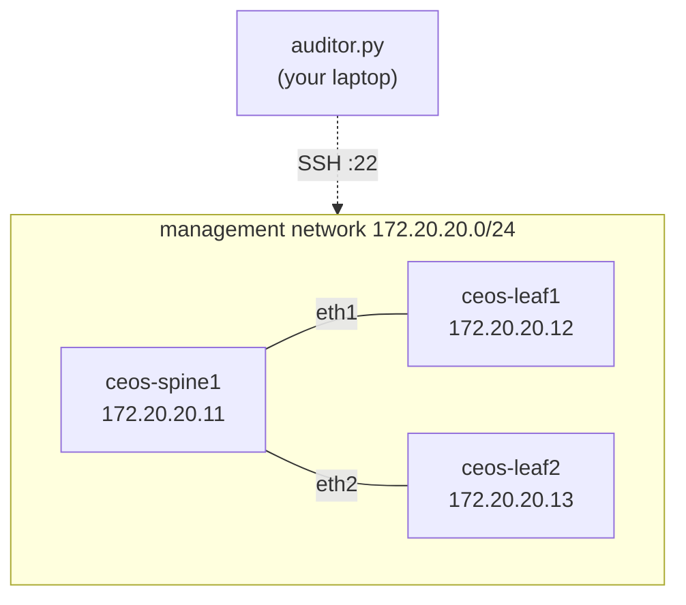

# Network Config Compliance Auditor

SSH into your network devices, back up their running configuration, and audit
each one against a golden baseline defined in YAML — so you find out a switch
drifted from standard *before* an auditor does.

> **Status: Phases 1–2 of 5 complete**, verified against three Arista cEOS
> nodes running under Containerlab. Inventory, connectivity, credential
> handling, config backup, and the CLI are built and tested. The compliance
> engine (Phase 3), HTML/Markdown reports (Phase 4), and the scheduled
> compliance workflow (Phase 5) are next. See [Roadmap](#roadmap).

## The problem

Every network has a standard: NTP servers, AAA, SNMP communities, a login
banner, `no ip http server`. Every network also has a switch that quietly lost
one of them during a 2 a.m. change three months ago. Finding that switch by
hand means SSHing into forty boxes and reading forty configs.

This tool does that pass in seconds, tells you exactly which lines are missing
or forbidden, and exits non-zero so CI can fail the build on drift.

## Lab topology



Three Arista cEOS containers under [Containerlab](https://containerlab.dev/).
Full setup in [lab/README.md](lab/README.md).

## Sample output


And a device that is down, to show the failure path (stop one node with
`docker stop clab-netaudit-ceos-leaf2`):

```console
│ ceos-leaf2  │ 172.20.20.13:22 │ arista_eos │ UNREACHABLE │ 10.0s │ could not open TCP session to device │
Summary: 2/3 reachable, 1 failed
```

## Features

**Built (Phase 1)**

- **YAML inventory** with a `defaults:` block, per-device overrides, and tags
  for slicing the fleet (`--tag spine`)
- **No credentials in the repo.** The inventory names a credential *profile*;
  secrets come from environment variables or a gitignored `.env`
- **Graceful per-device failure.** Unreachable, auth-failed, timed-out, and
  misconfigured devices each get their own status; one dead box never aborts
  the run
- **Concurrent collection** — devices are polled in a thread pool, so a device
  sitting on a 10-second connect timeout doesn't hold up the other thirty-nine
- **Retries with backoff** for transient failures only (retrying a wrong
  password is pointless, so it doesn't)
- **Strict inventory validation** — a typo like `devcie_type` is a startup
  error, not a confusing SSH failure ten minutes later
- **Table or JSON output**, meaningful exit codes, and 101 unit tests that run
  without touching a network

**Built (Phase 2)**

- **Timestamped backups** to `backups/<device>/<UTC>.cfg`, written atomically so
  a crash can't leave a truncated file where a config should be
- **Unchanged configs aren't rewritten**, so the directory is a change history
  rather than a cron log — volatile lines (`! Last configuration change at …`,
  `ntp clock-period`) are ignored when comparing, or every run would look like drift
- **Bad captures can't overwrite good history** — a config that's empty,
  truncated, or an error string is `REJECTED` and nothing is written
- **Optional `--git-commit`** to version config history; a failed commit never
  turns a successful backup into a failed run

**Planned** — see [Roadmap](#roadmap).

## Tech stack

| Piece | Choice | Why |
|---|---|---|
| SSH | [Netmiko](https://github.com/ktbyers/netmiko) | Handles per-vendor prompts, paging, and enable mode |
| Config | PyYAML | Inventory and golden rules live in data, not code |
| CLI | argparse | Standard library; no dependency for something this small |
| Console | [rich](https://github.com/Textualize/rich) | Colorized tables that degrade cleanly in CI logs |
| Tests | pytest | Network layer is dependency-injected, so it's testable without a lab |
| CI | GitHub Actions | Unit tests now; scheduled compliance runs in Phase 5 |

## Setup

Requires Python 3.11+.

```bash
git clone <your-repo-url> && cd net-config-auditor
python -m venv .venv
```

Activate it — `.venv\Scripts\Activate.ps1` on Windows PowerShell,
`source .venv/bin/activate` on macOS/Linux — then:

```bash
pip install -r requirements-dev.txt
```

### Credentials

Never in the repo. Copy the example and fill it in:

```bash
cp .env.example .env
```

```ini
NETAUDIT_LAB_USERNAME=admin
NETAUDIT_LAB_PASSWORD=admin
```

A device with `credentials: lab` in `inventory.yaml` resolves against
`NETAUDIT_LAB_*`, falling back per-field to the unprefixed `NETAUDIT_*`. So one
default pair covers the whole fleet, and only the devices that differ need a
profile. `.env` is gitignored; in CI, use GitHub Actions secrets instead — real
environment variables win over the file, so a stale `.env` can't shadow them.

SSH keys work too: put `key_file: ~/.ssh/netops_id_rsa` on the device (a path
isn't a secret) and drop the password.

### Lab

Follow [lab/README.md](lab/README.md) and don't move on until
`ssh admin@172.20.20.11` gets you a prompt by hand. Netmiko problems and
"the device isn't up yet" problems look identical from the CLI.

## Usage

Check what the tool parsed out of your inventory — no SSH involved:

```bash
python auditor.py --list-devices
```

Connect to every device and run its backup command:

```bash
python auditor.py --test-connection
```

Back up every device's running config:

```bash
python auditor.py --backup
```

```console
│ ceos-spine1 │ WRITTEN   │ 49 │ backups/ceos-spine1/20260802T032349Z.cfg │
│ ceos-leaf1  │ UNCHANGED │ 47 │ no change since 20260802T032349Z.cfg     │
Backups: 1 written, 1 unchanged
```

Version that history in git:

```bash
python auditor.py --backup --git-commit
```

Slice the fleet, tune concurrency, get machine-readable output:

```bash
python auditor.py --test-connection --tag leaf --workers 16 --json
```

Debug a single device with full SSH logging:

```bash
python auditor.py --test-connection --device ceos-leaf1 -vv
```

`--help` lists everything. Useful flags: `--device/-d` and `--tag` to filter,
`--command/-c` to run something other than the backup command, `--retries`,
`--json`, `--show-output`, `--no-color`, `-v`/`-vv`.

### Exit codes

| Code | Meaning |
|---|---|
| 0 | Everything succeeded |
| 1 | Run completed, but one or more devices failed |
| 2 | Run couldn't start — bad inventory, missing credentials, bad arguments |
| 130 | Interrupted |

The 1-vs-2 split is deliberate: CI should treat "a switch is unreachable"
differently from "your inventory file is broken."

## Tests

```bash
pytest
```

101 tests, no network required — the Netmiko connection factory is injected, so
the error taxonomy, retry logic, concurrency, and CLI exit codes are all tested
against a fake device.

## Project layout

```
auditor.py              # entry point
netauditor/
  cli.py                # argparse, exit codes
  inventory.py          # YAML parsing + validation
  credentials.py        # env-var resolution
  connect.py            # Netmiko wrapper, error classification, retries
  runner.py             # thread pool across devices
  backup.py             # timestamped writes, change detection, sanity checks
  gitstore.py           # optional git commit of new backups
  report.py             # console tables + JSON
  models.py             # Device, DeviceResult, DeviceStatus
inventory.yaml          # devices (no secrets)
lab/                    # Containerlab topology + Phase 0 instructions
tests/
```

## Design decisions

**Why Netmiko over raw Paramiko.** Paramiko gives you a shell channel; it does
not know that IOS pages output with `--More--`, that EOS needs `terminal length
0`, or how to get into enable mode. Netmiko is one dependency that removes an
entire category of per-vendor bugs, and its platform names (`arista_eos`,
`cisco_xe`) become the `device_type` field in the inventory — the schema is
already multivendor even though the lab is currently all EOS.

**Why golden rules live in YAML, not Python.** A compliance tool whose rules are
hardcoded is a script for exactly one network. Keeping the inventory and (in
Phase 3) the rule set in data means the same binary audits lab and production
with different files, and a network engineer who doesn't write Python can still
change what "compliant" means.

**Why credentials are profiles, not values.** `inventory.yaml` is committed, so
it can only ever name a profile. The mapping from `credentials: lab` to
`NETAUDIT_LAB_PASSWORD` is mechanical, which means adding a device with
different credentials needs no code change and no secret in git. Secrets are
also marked `repr=False` on the dataclass, so they can't leak into a traceback
or a debug log.

**Why a successful SSH session isn't a successful collection.** The first run
against real cEOS returned `OK` for all three devices — and the "config" it
collected was `% Invalid input (privileged mode required)`. Netmiko had done its
job perfectly: it connected, sent the command, and returned the answer. The
device just happened to answer with a refusal. `output_problem()` now inspects
what came back, so a rejection is `COMMAND_FAILED` rather than a one-line file
that Phase 3 would cheerfully audit against golden rules. Every layer that only
checks *transport* success has this hole in it.

**Why the lab's backups are committed, and why yours might not be.** `backups/`
contains real captures from the Containerlab topology, including
`username admin … secret sha512 $6$…`. That is deliberate: the hash is of
`admin`, containerlab's documented default, salted, on a disposable container
on an RFC1918 network that is destroyed with `containerlab destroy`. Nothing
there is a secret, and committing it is what makes config history visible
rather than theoretical — `git log backups/ceos-leaf1/` is the feature working.

A production fleet is the opposite case. Running-configs carry credential
hashes, SNMP communities, and pre-shared keys, and a real backup repo belongs
somewhere private with restricted access — or `backups/` goes in `.gitignore`
and the configs go to storage with an access policy. The tool doesn't care
which; `--git-commit` is opt-in for exactly this reason.

**Why one dead device can't fail the run.** `connect.collect()` never raises —
it classifies the exception and returns a result. That is what makes the
difference between a tool that audits 39 of 40 switches and tells you about the
40th, and a tool that crashes on device 12 and audits nothing. The classifier
is a pure function, which is why it can be unit tested against nine different
failure modes without a lab.

**Why retries are selective.** Only `UNREACHABLE` and `TIMEOUT` are retried. An
authentication failure or an unsupported `device_type` is deterministic —
retrying it four more times just makes a failing run slower.

**Why a thread pool.** SSH collection is almost entirely blocking I/O. Forty
sequential devices, each with a 10-second connect timeout, is a worst case of
nearly seven minutes; eight workers turns that into under a minute. asyncio
would work too, but Netmiko's async support is immature and threads are the
honest fit for a blocking library.

## Roadmap

- [x] **Phase 0** — Containerlab topology, three cEOS nodes reachable over SSH
- [x] **Phase 1** — inventory, credentials, connectivity, error handling, CLI
- [x] **Phase 2** — back up configs to `backups/<hostname>/<timestamp>.cfg`, optional git commit
- [ ] **Phase 3** — compliance engine: `required` / `forbidden` / regex rules in YAML
- [ ] **Phase 4** — HTML and Markdown reports alongside the console output
- [ ] **Phase 5** — scheduled GitHub Actions compliance run that fails on drift

v2 ideas, only once the above is done: a diff view between two backups,
multivendor rule sets, and a Nornir rewrite.
