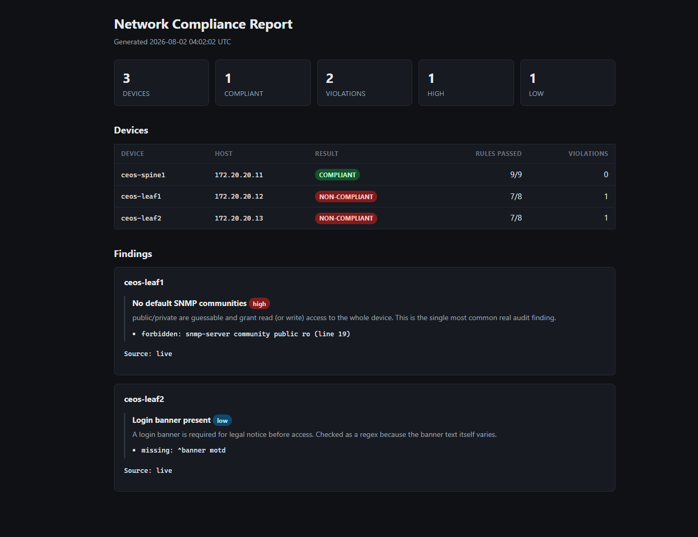
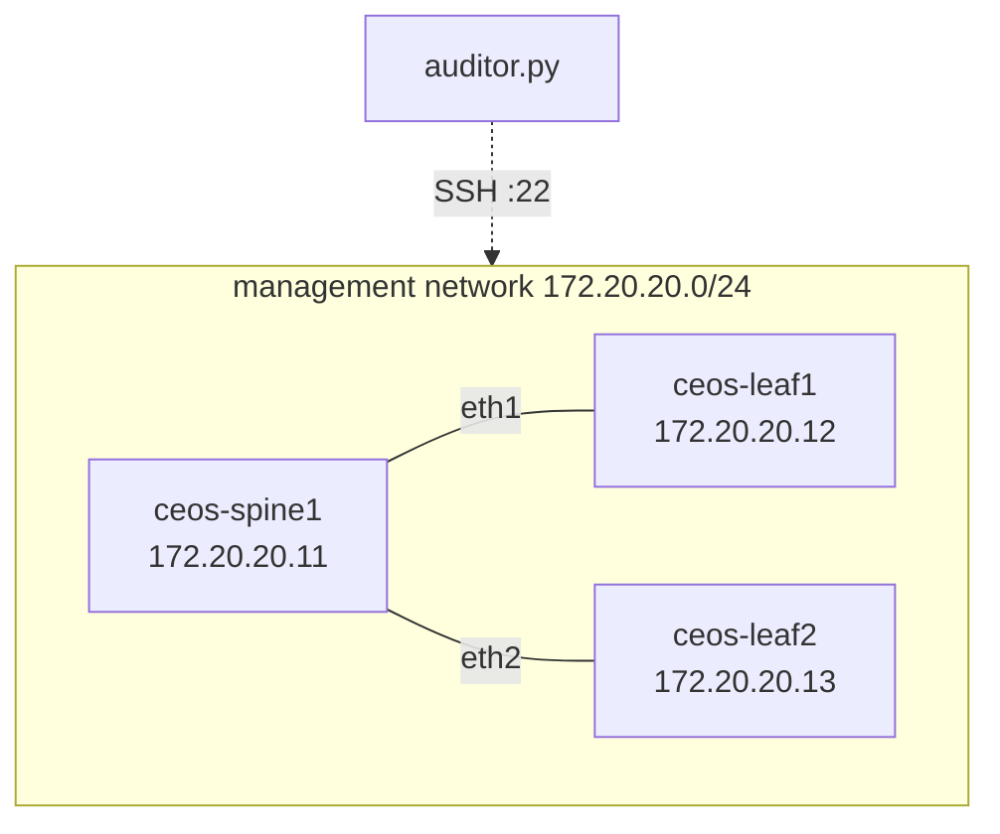

# Network Config Compliance Auditor

[](https://github.com/hanksqt/Network-Config-Compliance-Auditor/actions/workflows/ci.yml)
[](https://github.com/hanksqt/Network-Config-Compliance-Auditor/actions/workflows/compliance.yml)

SSH into your network devices, back up their running configs, and audit each one
against a golden baseline written in YAML. You find the switch that drifted
before an auditor does.



## The problem

Every network has a standard. NTP servers, AAA, SNMP communities, a login
banner. Every network also has a switch that quietly lost one of them during a
2 a.m. change three months ago, and nobody noticed because nothing broke.

Finding it by hand means SSHing into forty boxes and reading forty configs. This
does that pass in seconds, names the exact lines that are wrong, and exits
non-zero so CI can fail the build on drift.

## Lab



Three Arista cEOS containers under [Containerlab](https://containerlab.dev/).
Setup in [lab/README.md](lab/README.md).


## What it does

**Inventory and credentials.** Devices live in `inventory.yaml` with a
`defaults:` block, per-device overrides, and tags for slicing the fleet. No
secrets in the repo: the inventory names a credential *profile*, and the actual
values come from environment variables or a gitignored `.env`. SSH keys work
too.

**Collection that survives bad devices.** Unreachable, auth-failed, timed out,
and misconfigured devices each get their own status. One dead box never aborts
the run. Devices are polled in a thread pool, so a switch sitting on a
10-second connect timeout doesn't hold up the other thirty-nine, and only
transient failures are retried.

**Backups with a real change history.** Configs are written to
`backups/<device>/<UTC>.cfg`, atomically. An unchanged config isn't rewritten,
so the directory is a history of what actually changed rather than a log of how
often cron ran. Volatile lines like `! Last configuration change at …` are
ignored when comparing. A capture that comes back empty, truncated, or as an
error string is rejected rather than allowed to overwrite good history.
`--git-commit` versions the whole thing.

**A compliance engine driven by data.** Rules live in
[golden.yaml](golden.yaml): `required` lines, `forbidden` lines, regex variants,
per-rule severity, and descriptions that show up in the report. Rules can be
scoped by inventory tag, so a spine-only rule doesn't need its own file.
Violations name the offending line and its line number. By default the audit
reads the latest backup, which needs no network and runs anywhere;
`--check --live` audits what the devices have right now.

**Reports you can actually send someone.** `--report path.html` or `.md` or
`.json`, format picked from the extension. The HTML is one self-contained file
with inline CSS and no external requests. Markdown renders natively on GitHub,
so it drops into a ticket, a PR comment, or an Actions job summary. Here's a
[sample](docs/sample-report.md) from a run where the lab had drifted.

**Scheduled auditing.** A [workflow](.github/workflows/compliance.yml) runs on a
weekday cron, on demand, and on any push touching configs or rules. It publishes
the report to the job summary and fails the build on drift, with no credentials
configured at all.

## Tech stack

| Piece | Choice | Why |
|---|---|---|
| SSH | [Netmiko](https://github.com/ktbyers/netmiko) | Per-vendor prompts, paging, and enable mode already solved |
| Config | PyYAML | Inventory and rules live in data, not code |
| CLI | argparse | Standard library, no dependency needed for this |
| Console | [rich](https://github.com/Textualize/rich) | Colorized tables that degrade cleanly in CI logs |
| Tests | pytest | The network layer is injected, so it tests without a lab |
| CI | GitHub Actions | Unit tests on push, compliance audit on a schedule |

## Setup

Python 3.11 or newer.

```bash
git clone https://github.com/hanksqt/Network-Config-Compliance-Auditor.git
cd Network-Config-Compliance-Auditor
python -m venv .venv
```

Activate it (`.venv\Scripts\Activate.ps1` on Windows, `source .venv/bin/activate`
elsewhere), then:

```bash
pip install -r requirements-dev.txt
```

### Credentials

```bash
cp .env.example .env
```

```ini
NETAUDIT_LAB_USERNAME=admin
NETAUDIT_LAB_PASSWORD=admin
```

A device with `credentials: lab` in `inventory.yaml` resolves against
`NETAUDIT_LAB_*`, falling back field by field to the unprefixed `NETAUDIT_*`.
One default pair covers the whole fleet, and only the devices that differ need
their own profile.

`.env` is gitignored. In CI, use Actions secrets instead: real environment
variables win over the file, so a stale `.env` can't shadow them.

For key auth, put `key_file: ~/.ssh/netops_id_rsa` on the device (a path isn't a
secret) and drop the password.

### Lab

Follow [lab/README.md](lab/README.md), and don't move on until
`ssh admin@172.20.20.11` gets you a prompt by hand. Netmiko problems and "the
device hasn't finished booting" problems look identical from the CLI, and you
will waste an hour on the wrong one.

## Usage

See what the tool parsed out of your inventory, with no SSH involved:

```bash
python auditor.py --list-devices
```

Connect to everything and confirm it answers:

```bash
python auditor.py --test-connection
```

Back up every running config:

```bash
python auditor.py --backup
```

```console
│ ceos-spine1 │ WRITTEN   │ 49 │ backups/ceos-spine1/20260802T032349Z.cfg │
│ ceos-leaf1  │ UNCHANGED │ 47 │ no change since 20260802T032349Z.cfg     │
Backups: 1 written, 1 unchanged
```

Audit against the golden config, and write a report:

```bash
python auditor.py --check --report reports/compliance.html
```

```console
│ ceos-spine1 │ NON-COMPLIANT │ 7/9 │ 3 │ Spines must route, Login banner present │
│ ceos-leaf1  │ COMPLIANT     │ 8/8 │ 0 │                                         │

ceos-spine1
  ✗ Spines must route  [high]
      - missing: ip routing
      - forbidden: no ip routing (line 38)
```

Filter the fleet, tune concurrency, get JSON:

```bash
python auditor.py --check --live --tag leaf --workers 16 --json
```

Debug one device with full SSH logging:

```bash
python auditor.py --test-connection --device ceos-leaf1 -vv
```

`--help` has the rest.

### Exit codes

| Code | Meaning |
|---|---|
| 0 | Everything passed |
| 1 | The run finished, but a device failed or is non-compliant |
| 2 | The run couldn't start: bad inventory, missing credentials, bad arguments |
| 130 | Interrupted |

The 1 vs 2 split is deliberate. CI should treat "a switch is unreachable"
differently from "your inventory file is broken."

## Auditing live devices from CI

The scheduled workflow audits the configs committed under `backups/`. That's a
real check, it catches drift the moment a changed config lands, and it needs no
network access and no secrets.

It does not SSH to anything, and no GitHub-hosted runner could: your devices sit
on a management network that `ubuntu-latest` has no route to. A workflow
claiming otherwise would be theatre.

To audit live devices on a schedule you need a runner that can reach them:

1. Register a [self-hosted runner](https://docs.github.com/en/actions/hosting-your-own-runners)
   on the management network
2. Add `NETAUDIT_LAB_USERNAME` and `NETAUDIT_LAB_PASSWORD` as repository secrets
3. In `compliance.yml`, change the `live-audit` job's `if: false` to
   `if: github.event_name == 'schedule'`

That job runs `--backup` and then `--check --live`, in that order on purpose.
Auditing whatever happened to be committed last week would report green while a
switch is actively misconfigured.

## Tests

```bash
pytest
```

209 tests, no network needed. The Netmiko connection factory is injected, so the
error taxonomy, retry logic, concurrency, backup writing, rule evaluation, and
CLI exit codes are all tested against a fake device.

## Layout

```
auditor.py              # entry point
netauditor/
  cli.py                # argparse, exit codes
  inventory.py          # YAML parsing + validation
  credentials.py        # env-var resolution
  connect.py            # Netmiko wrapper, error classification, retries
  runner.py             # thread pool across devices
  backup.py             # timestamped writes, change detection, sanity checks
  gitstore.py           # optional git commit of new backups
  golden.py             # golden.yaml parsing + strict validation
  compliance.py         # rule evaluation, violation reporting
  render.py             # HTML + Markdown reports
  report.py             # console tables + JSON
  models.py             # Device, DeviceResult, ComplianceResult
inventory.yaml          # devices, no secrets
golden.yaml             # what "compliant" means
lab/                    # Containerlab topology + setup
```

## Design decisions

**A successful SSH session is not a successful collection.** The first run
against real cEOS reported `OK` on all three devices. The config it collected
was `% Invalid input (privileged mode required)`. Netmiko had done its job
perfectly: it connected, sent the command, returned the answer. The device just
answered with a refusal. All 102 tests were green at the time, because the fake
connection in the test suite always returned plausible output, so the suite was
testing my code's happy path rather than the device's. `output_problem()` now
inspects what came back, and `write_backup()` refuses to overwrite good history
with a bad capture. Any layer that only checks *transport* success has this
hole in it.

**Rules live in YAML, not Python.** A compliance tool with hardcoded rules is a
script for exactly one network. Keeping the inventory and the rule set in data
means the same tool audits lab and production from different files, and a
network engineer who doesn't write Python can still change what compliant means.

**Credentials are profiles, not values.** `inventory.yaml` is committed, so it
can only name a profile. Mapping `credentials: lab` to `NETAUDIT_LAB_PASSWORD`
is mechanical, so adding a device with different credentials needs no code
change and no secret in git. Secrets are marked `repr=False` on the dataclass so
they can't leak into a traceback or a debug log.

**Rule matching is exact, not substring.** `required: ["ip routing"]` matches a
config line of `ip routing`, including indented, but not `ip routing ipv6`.
Substring matching reads as friendlier right up until
`forbidden: ["ip http server"]` is satisfied by a comment mentioning it. The
expensive failure in a compliance tool is a rule that silently passes, so a rule
either matches what you meant or visibly does not. Regex variants handle
everything else. For the same reason, a rule defining no checks at all is a load
error, and so is a typo like `forbiden`.

**Unreachable is not compliant.** A device with no backup, or one that couldn't
be collected, is reported as an error and counted against the run. Skipping
those would let the tool report "3/3 compliant" from two devices, which is how a
compliance report becomes a lie.

**An offline audit needs no credentials.** `--check` against committed backups
opens no socket, so `Device.credentials` stays `None` and any attempt to connect
raises. This came out of writing the CI workflow: the first draft injected fake
`NETAUDIT_*` values so an offline operation would agree to start, which is a
design smell wearing a workaround as a disguise. A runner that can't reach the
devices has no business holding their credentials.

**One dead device can't fail the run.** `connect.collect()` never raises. It
classifies the exception and returns a result, which is the difference between a
tool that audits 39 of 40 switches and tells you about the 40th, and a tool that
crashes on device 12 and audits nothing. The classifier is a pure function, so
it's unit tested against nine failure modes with no lab.

**The lab's backups are committed, and yours might not be.** `backups/` holds
real captures including `username admin … secret sha512 $6$…`. That hash is of
`admin`, containerlab's documented default, salted, on a disposable container on
an RFC1918 network. Nothing there is a secret, and committing it is what makes
`git log backups/ceos-leaf1/` show the feature working. A production fleet is
the opposite case: running-configs carry real credential hashes, SNMP
communities, and pre-shared keys, and belong in a private repo or behind an
access policy. `--git-commit` is opt-in for that reason.

## Status

All five phases are built and verified against the live lab.

- [x] Containerlab topology, three cEOS nodes reachable over SSH
- [x] Inventory, credentials, connectivity, error handling, CLI
- [x] Config backup with change detection and optional git commit
- [x] Compliance engine with YAML-defined rules
- [x] HTML, Markdown, and JSON reports
- [x] Scheduled GitHub Actions audit that fails on drift

Next: a diff view between two backups, multivendor rule sets, and possibly a
Nornir rewrite.
